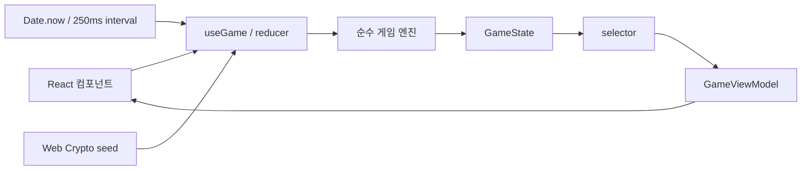

# 아키텍처와 주요 결정

게임은 브라우저 메모리에서 완결됩니다. 서버, DB, 계정, 저장/복원 기능은 없습니다. 실행 가능한 공개 계약은 [`src/contracts/game.ts`](../../src/contracts/game.ts), 구현은 `src/features/game/`에 있습니다.

## 설치 버전

`package-lock.json` 기준 React/React DOM 19.2.8, TypeScript 5.9.3, Vite 7.3.6, Vitest 4.1.11, Playwright 1.63.0, ESLint 9.39.5, Prettier 3.9.7입니다. 설치는 `npm ci`로 고정합니다.

## 결정 기록

| 결정                       | 이유와 비교한 대안                                                                                                      |
| -------------------------- | ----------------------------------------------------------------------------------------------------------------------- |
| React + useReducer         | 단일 게임의 이벤트와 화면을 동기화합니다. Redux/Zustand는 현재 규모에 추가 상태 계층이 필요하지 않아 사용하지 않습니다. |
| Vite 정적 빌드             | SSR·라우팅·서버가 없어 Next.js나 별도 웹 서버가 필요하지 않습니다. `dist/`만 정적 호스팅합니다.                         |
| DOM 버튼 + CSS Grid        | 최대 1,600칸에서 접근 가능한 이름과 실제 클릭을 직접 테스트합니다. Canvas의 별도 접근성·이벤트 계층을 피합니다.         |
| 순수 엔진 + seed/time 주입 | 같은 입력을 재현할 수 있어 규칙 테스트가 안정적입니다. 엔진에서 DOM·타이머 API를 호출하지 않습니다.                     |
| CSS Modules                | 섬 테마와 반응형을 런타임 스타일 라이브러리 없이 구성합니다.                                                            |
| Vitest + Playwright        | 규칙·UI 이벤트를 빠르게 검사하고 실제 Chromium/WebKit 동작을 별도로 확인합니다. 스냅샷만으로 규칙을 검증하지 않습니다.  |
| 메모리 상태                | 계정·랭킹·복원이 범위에 없어 DB와 동기화 계층을 두지 않습니다. 새로고침하면 10×10 새 게임이 생깁니다.                   |

## 규칙과 경계

새 게임 생성 시 돌부터 배치하고 첫 유효 공개에서 지뢰를 배치합니다. 기본 돌 수는 `round(전체 칸 × 0.08)`이며 상하좌우로 연결된 돌 덩어리는 최대 4칸입니다. 기본 보호 가중치 `[5, 10, 15, 20, 20, 15, 10, 5]`는 인접 땅 1~8칸을 보호할 확률입니다. 실제 인접 후보가 적으면 그 수까지만 보호합니다. 설정은 `src/features/game/config/defaults.ts`에서 조정합니다.

빈칸 확산은 큐 기반 탐색으로 재귀 깊이를 피합니다. 숨은 지뢰 정보는 selector가 제거하며 컴포넌트는 공개용 뷰만 소비합니다. 계약 모듈은 타입과 함께 실제 함수·기본값을 재노출하므로 단순 타입 선언 전용 파일은 아닙니다.

타이머는 interval 횟수가 아닌 시작·종료 시각 차이로 계산합니다. 훅은 상태·시작 시각·오류가 바뀌거나 unmount될 때 interval을 해제합니다. 정상 클릭이나 보드 전체를 로깅하지 않으며 원격 분석 SDK도 없습니다.

HTML CSP는 자기 출처 자산을 기본으로 허용하고 `object-src 'none'`을 적용합니다. 현재 스타일에는 `'unsafe-inline'`, 연결에는 개발 환경을 위한 `ws:`가 허용돼 있습니다. 외부 API 통신이나 서비스 워커는 사용하지 않습니다.
